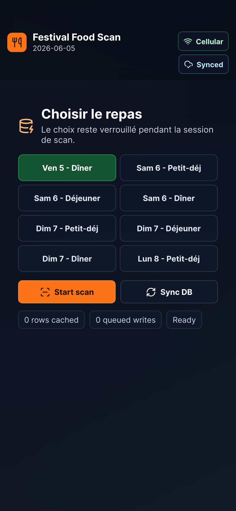
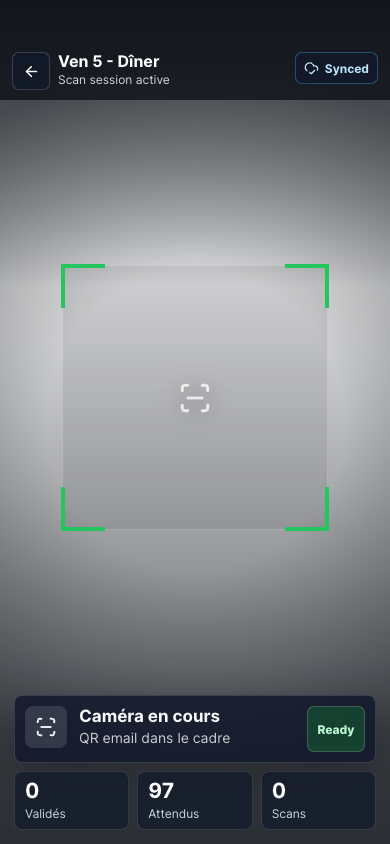

# Festival Food Scan

Tiny Capacitor app for festival staff to scan food QR codes and mark one selected meal as used.

Setup page:



Scan session page:



The scanner uses Capgo Camera Preview (`@capgo/camera-preview`) with its native `barcodeScanner` QR feature. It does not use the basic Capacitor Camera API.

Network status uses Capgo Network Diagnostics (`@capgo/capacitor-network-diagnostics`) internally for sync retries. The UI only shows the sync queue state.

## Current NocoDB Table

Base: `Académie Perspectives`

Table: `Festival juin 2026`

Table id: `mnglg169g5rhka5`

View: `festival-juin-2026-festival-juin-2026`

The app expects the QR code text to be the guest email. If several rows have the same email, the app treats them as several valid passes. For example, a couple sharing one email can scan twice if two paid, entitled rows exist for the selected meal.

## Scan Flow

1. Staff chooses the meal once on the setup screen.
2. Staff starts the scan session.
3. The app checks whether the network is usable. No network, no internet, captive portal, constrained data, very low speed, or low speed all switch quickly to local cache mode.
4. If the network is usable, the app downloads the NocoDB rows and applies any queued local scans.
5. If the network is not usable or NocoDB times out, the app starts from cached rows without blocking the scanner.
6. The camera stays active for repeated scans.
7. Every QR scan tries to refresh NocoDB first so another phone's recent scans are visible.
8. If that refresh fails or is too slow, validation continues from the local cached rows and the sync pill shows `Local DB`.
9. A successful scan is saved locally immediately and queued for NocoDB.
10. The app retries queued writes at session start, after each scan, when the network is usable, and when staff taps `Sync DB`.
11. If internet is offline or NocoDB rejects a write, scanning continues and the write stays queued.
12. To change the meal, staff leaves the scan session and chooses another meal.

## Validation Rules

For the selected meal, the app checks the matching row fields:

| Result | Rule |
| --- | --- |
| `Oui, suivant` | `Date paiement` exists, the selected meal checkbox is true, and an unused matching row exists. |
| `Déjà fait` | All paid, entitled rows for that email and meal already have the matching `Scanned ...` timestamp. |
| `Non payé` | No row for that email is both paid and entitled for the selected meal. |
| `Inconnu` | No row exists for the scanned email. |
| `Erreur` | Required scan timestamp columns are missing or the QR is invalid. |

## Required DB Shape

Existing fields verified in the table:

| Field | Type | Purpose |
| --- | --- | --- |
| `Id` | ID | Row id used for NocoDB PATCH writes. |
| `Nom` | text | Display name shown after scan. |
| `Email` | email | QR payload and row lookup key. |
| `Montant` | currency | Payment amount, informational for the app. |
| `Mollie ID` | text | Payment id, informational for the app. |
| `Date paiement` | datetime | Required payment marker. Empty means not paid. |
| `Arrivé` | checkbox | App sets this to true when a scan is queued/synced. |
| `Vegetarien` | checkbox | Menu info, informational for the app. |

Meal entitlement checkboxes already exist:

| Meal | Existing checkbox |
| --- | --- |
| Friday dinner | `Ven 5 - Dîner` |
| Saturday breakfast | `Sam 6 - Petit-déj` |
| Saturday lunch | `Sam 6 - Déjeuner` |
| Saturday dinner | `Sam 6 - Dîner` |
| Sunday breakfast | `Dim 7 - Petit-déj` |
| Sunday lunch | `Dim 7 - Déjeuner` |
| Sunday dinner | `Dim 7 - Dîner` |
| Monday breakfast | `Lun 8 - Petit-déj` |

Add these DateTime columns with the exact titles:

| Meal | New DateTime column |
| --- | --- |
| Friday dinner | `Scanned Ven 5 - Dîner` |
| Saturday breakfast | `Scanned Sam 6 - Petit-déj` |
| Saturday lunch | `Scanned Sam 6 - Déjeuner` |
| Saturday dinner | `Scanned Sam 6 - Dîner` |
| Sunday breakfast | `Scanned Dim 7 - Petit-déj` |
| Sunday lunch | `Scanned Dim 7 - Déjeuner` |
| Sunday dinner | `Scanned Dim 7 - Dîner` |
| Monday breakfast | `Scanned Lun 8 - Petit-déj` |

These columns are required because the meal checkbox means “this guest has this meal included”, while `Scanned ...` means “this exact meal was already taken”.

## Configure The App

Create `.env.local`:

```env
VITE_NOCODB_BASE_URL=https://sheets.perspectives.ac
VITE_NOCODB_TABLE_ID=mnglg169g5rhka5
VITE_NOCODB_TOKEN=
VITE_FESTIVAL_TIME_ZONE=Europe/Paris
```

The NocoDB token must be allowed to read the table and PATCH rows. A read-only token can download rows but cannot sync queued scans back to NocoDB.

For a one-phone staff app, direct NocoDB access is simple. For a wider distributed app, put a small backend or Worker in front of NocoDB so the database token is not embedded in the mobile bundle.

## Add Columns With The API

You can add each scan column from the NocoDB UI as a DateTime field, or use the API:

```bash
curl -X POST 'https://sheets.perspectives.ac/api/v2/meta/tables/mnglg169g5rhka5/columns' \
  -H "xc-token: $NOCODB_TOKEN" \
  -H 'Content-Type: application/json' \
  -d '{"title":"Scanned Ven 5 - Dîner","uidt":"DateTime"}'
```

Repeat with each `Scanned ...` title listed above.

## Make QR Codes From Rows

Recommended QR payload:

```text
ada@example.com
```

The QR code should contain only the normalized email text. No JSON, no signed token, no custom id mapping.

In NocoDB:

1. Use the `Email` field as the QR payload.
2. Add a QR Code field if your NocoDB setup has that field type, and point it at `Email`.
3. If you prefer an image URL, create a formula/text field using this shape:

```text
https://quickchart.io/qr?size=300&text=<url-encoded Email>
```

Example generated URL:

```text
https://quickchart.io/qr?size=300&text=ada%40example.com
```

End-to-end send flow:

1. Import or create guest rows in `Festival juin 2026`.
2. Fill `Nom`, `Email`, `Date paiement`, and the meal checkboxes.
3. Generate one QR image from the `Email` value.
4. Email the QR image to the guest.
5. At the festival, staff picks the meal and starts a scan session.
6. Staff scans the guest QR code.
7. The app consumes one eligible row for that email and queues the `Scanned ...` timestamp write.

## Offline Behavior

The app stores two things locally:

| Local item | Purpose |
| --- | --- |
| NocoDB snapshot | Lets scan validation continue when internet drops after session start. |
| Pending writes queue | Keeps successful scans that still need to be patched to NocoDB. |

Queued writes are retried:

1. when the app opens,
2. when a scan session starts,
3. after each scan,
4. when staff taps `Sync DB`,
5. when staff leaves the session.

## Develop

```bash
npm install
npm run dev
```

## Test

```bash
npm run test
npm run lint
npm run build
```

## Capacitor

```bash
npm run build
npx cap sync
npx cap open ios
npx cap open android
```
